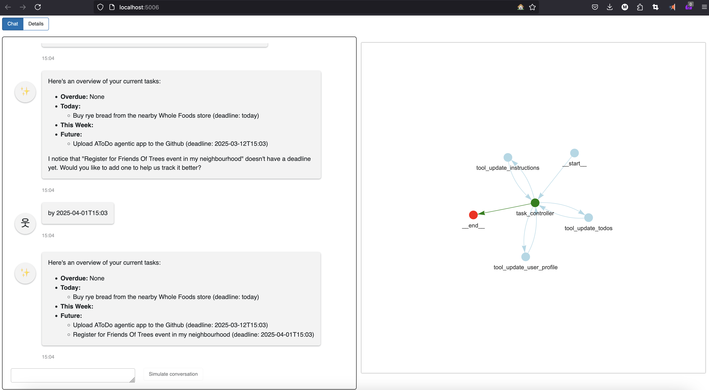

# atodo
Agentic App on ReAct architecture inspired by the **task_maistro** from LangChainAI. 

On the main "Chat" page user is presented with the chatbot interface, as well as with the Inference Graph on the left where currently active node is marked with "red".

